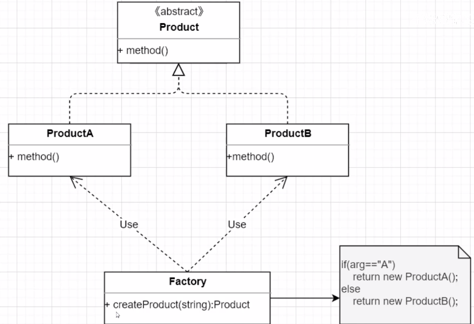

# Design patterns
# creational-patterns
- 工厂方法模式
- 抽象工厂模式
- 生成器模式
- 原型模式
- 单例模式

## 1. 单例模式
### 1.1 什么时候用单例模式？为什么需要单例模式
单例模式在整个运行时，一个类只有一个实例对象。有的类实例对象的创建和销毁对资源来说消耗不大，但是有的类比较庞大和复杂。如果频繁的创建和消费对象，并且这些对象是可以复用的话，将造成一些不必要的性能浪费。
比如创建数据库连接对象。 
### 1.2 单例模式的实现？
主要考虑三点：
1) 是不是线程安全？
2) 是不是懒加载
3) 能不能通过反射破坏
### 线程不安全
最简单的实现
```java
public class Singleton{
    //构造器设为private，其他的类没办法通过new来构造对象实例了
    private Singleton(){};
    private static Singleton instance = null;
    // 想用该类的实例，必须通过调用getInstance方法
    public static Singleton getInstance(){ 
        
        // 判断对象是否已经被构造过，若没有，则构造新的对象
        // 实例对象第一次被调用的时候才创建，这就是懒加载
        if (instance == null){
            instance = new Singleton();
        }
        // 过已构造过，则直接返回该对象
        return intance;
    }
}
// 这种实现方式不是线程安全的
```
目标：构建对象的时候同步，而使用对象的时候没必要同步

解决：双检锁(对象两次判空的操作)
```java
public class Singleton{
    private static Singleton singleton;
    private Singleton(){};
    public static Singleton getSingleton{
        if (singleton == null){
            synchronized (Singleton.class){
                if (singleton == null){
                    singleton = new Singleton();
                }
            }
        }
        return singleton;
    }
}
// 当多个线程同时进入getSingleton方法后，如果实例没有创建，其中首先只会有一个线程获得锁，进行对象的创建，当对象创建完毕后释放锁，
// 其他线程获得锁，会进行第二个if判断，由于对象不为空，则直接跳过，返回实例。
// 以后其他线程使用对象的时候就不需要要同步了(不需执行同步代码块)
```
然而上面的写法没有遵循happens-before原则, 因为`singleton = new Singleton();`在指令层面不是一个原子操作，它分为了三步
1) 分配内存
2) 初始化对象
3) 对象指向内存地址

在执行的时候，JVM为了效率可能会对指令进行重排，如1-3-2顺序执行。

解决：只要给`singleton`加上`volatile`修饰就可以了
```java
public class Singleton{
    private volatile static Singleton singleton;
    private Singleton(){};
    public static Singleton getSingleton{
        if (singleton == null){
            synchronized (Singleton.class){
                if (singleton == null){
                    singleton = new Singleton();
                }
            }
        }
        return singleton;
    }
}
```
## 2. 简单工厂模式
简单工厂模式属于类创建型模式。在简单工厂模式中，可以根据参数的不同返回不同类的实例。简单工厂模式专门定义一个类来负责创建其他类的实例，被创建的实例通常都具有共同的父类。

- 优点: 实现对象的创建和使用分离
- 缺点：不够灵活，新增产品需要修改工厂类，违背开闭原则


```java
public class SimpleFactory{
    public static Product createProduct(String type){
        if (type.equals("A"))
            return new ProductA;
        
        else 
            return new ProductB;
    }
}

abstract class Product{
    public abstract void print();
}

class ProductA extends Product{
    @Override
    public void print(){
        System.out.println("产品A");
    }
}

class ProductB extends Product{
    @Override
    public void print(){
        System.out.println("产品B");
    }
}

Class Test{
    public static void main(String[] args) {
        Product product = SimpleFactory.createProduct("A");
        product.print();
    }
}
```
### 工厂模式
定义一个用于创建对象的接口，让子类决定实例化哪个类。工厂方法使一个类的实例化延迟到其子类中。


```java
// 抽象工厂
interface Factory{
    Phone createPhone{}
}

// 具体工厂
class IphoneFactory implements Factory{
    @Override
    public Phone createPhone{
        return new Iphone();
    }
}

class HuaweiFactory implements Factory{
    @Override
    public Phone createPhone{
        return new HuaweiPhone();
    }
}

// 抽象产品
interface Phone{
    void print();
}

class Iphone implements Phone{
    @Override
    public void print(){
        System.out.println("Iphone");
    }
}

class HuaWeiPhone implements Phone{
    @Override
    public void print(){
        System.out.println("HuaWeiPhone");
    }
}
```
### 抽象工厂模式
工厂模式每个具体的工厂只能创建一大类的产品，而抽象工厂模式使得具体工厂还可以生产其他大类。抽象工厂模式只是工厂模式的一个扩展，抽象工厂模式如果只有一个产品体系的话就退化成工厂模式。

缺点：违反了开闭原则


```java
// 抽象工厂
interface AbstractFactory{
    Phone createPhone(String param);
    Mask createMask(String param);
}

// 具体工厂
class SupperFactory implements AbstactFactory{
    @Override
    public Phone createPhone(String param){
        return new Iphone();
    }
    
    @Override
    public Mask createMask(String param){
        return new N95();
    }
}

// 抽象产品
interface Phone{
    void print();
}

interface Mask{
    void print();
}

class Iphone implements Phone{
    @Override
    public void print(){
        System.out.println("Iphone");
    }
}
class N95 implements Mask{
    @Override
    public void print(){
        System.out.println("N95");
    }
}

```
